# How to install an app via BuddyBuild

These instructions will show you step by step how to install an app via BuddyBuild. From receiving the initial invite in your email to starting the app on your device.

## Step 1 - Locate the invitation email

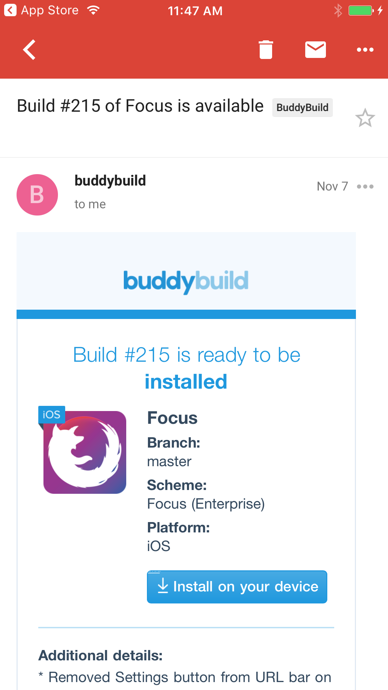

Tap the Install on your device link. BuddyBuild will tell you to register your device first.

## Step 2 - Register your Device

If this is the first time you use BuddyBuild to try out an app, you will be asked to register your device.

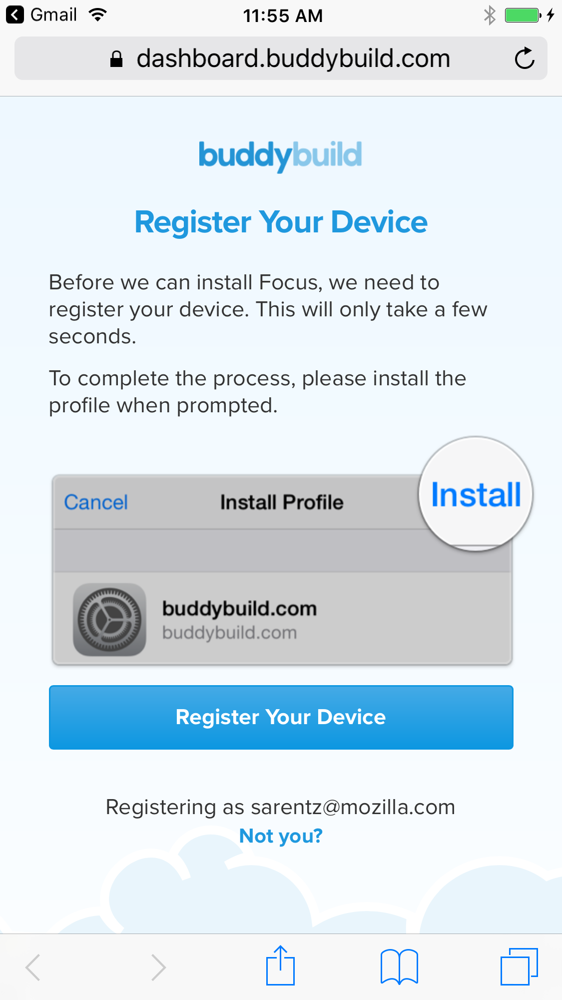

Hit Register your device, and you should see a screen that asks you if you want to install the BuddyBuild Profile:

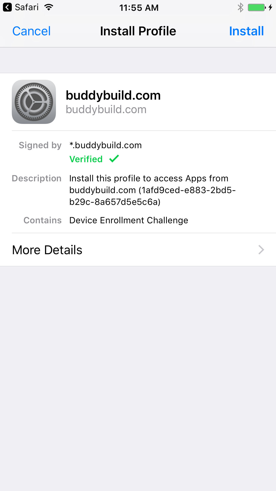

Hit install in the top right. You have to confirm by entering your passcode. At the end of this process you should be back in Safari and redirected to the app install page. If not, open the link in the email again.

## Step 5 - Download and Install the App

Hit *Download and Install* and you should be going through a bunch of screens. 

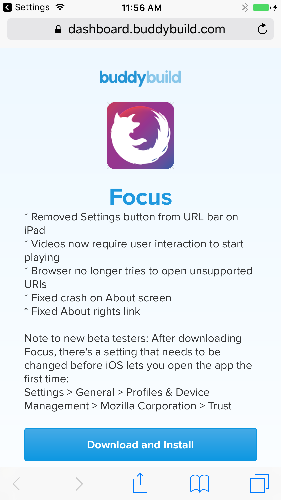
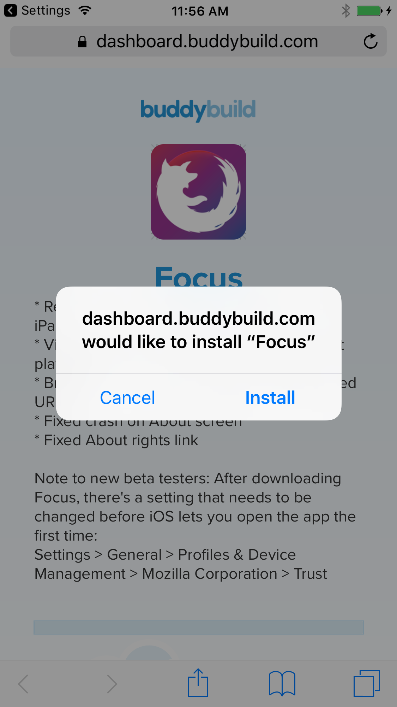
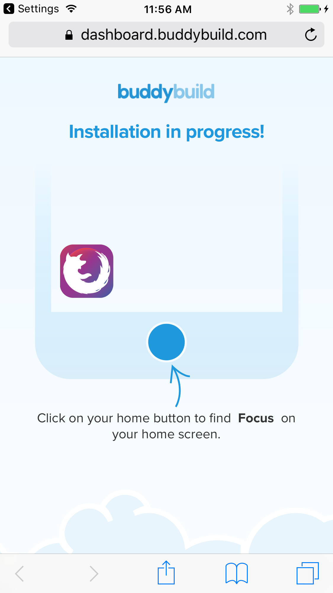

## Step 6 - Start the Application

Exit Safari and find the newly installed app on your Home Screen.

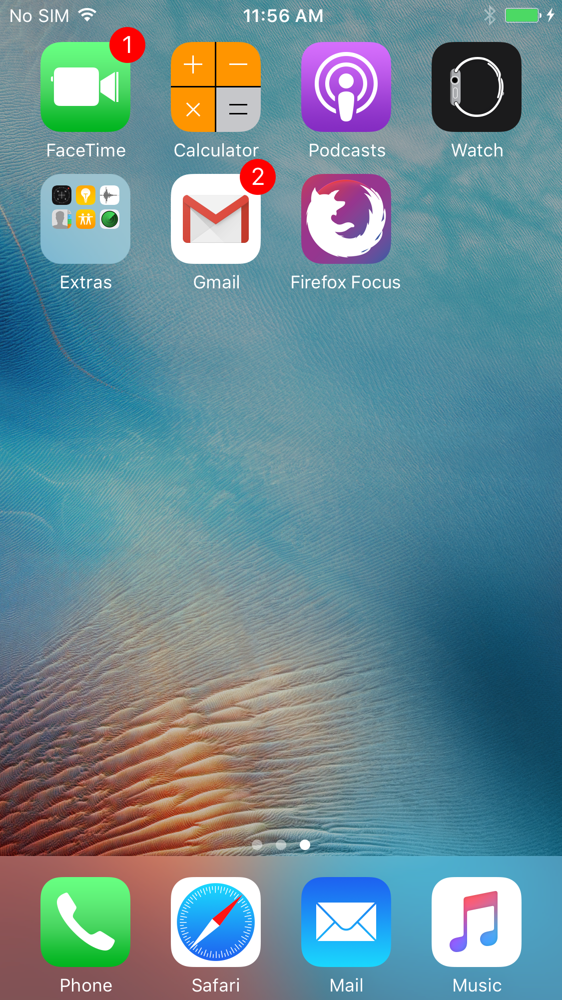

If you get a warning about an *Untrusted Enterprise Developer*, like below, you first need to go to your settings and trust *Mozilla Corporation*.

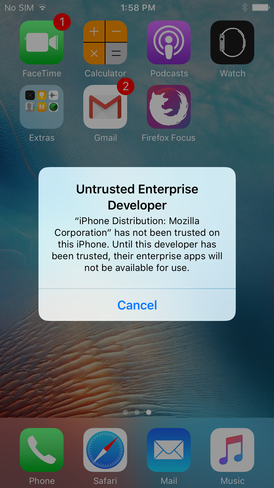

## Step 7 - Approve Mozilla Signed Applications

Open settings, go to *General*, then *Profiles & Device Management* and locate the *Mozilla Corporation* profile. Open it and approve it. After this you can start the installed application.

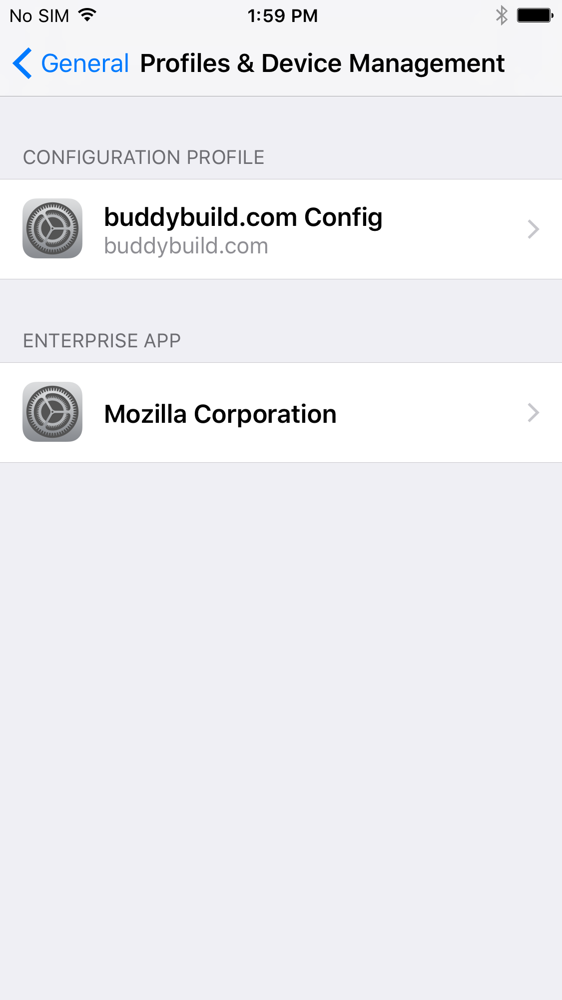
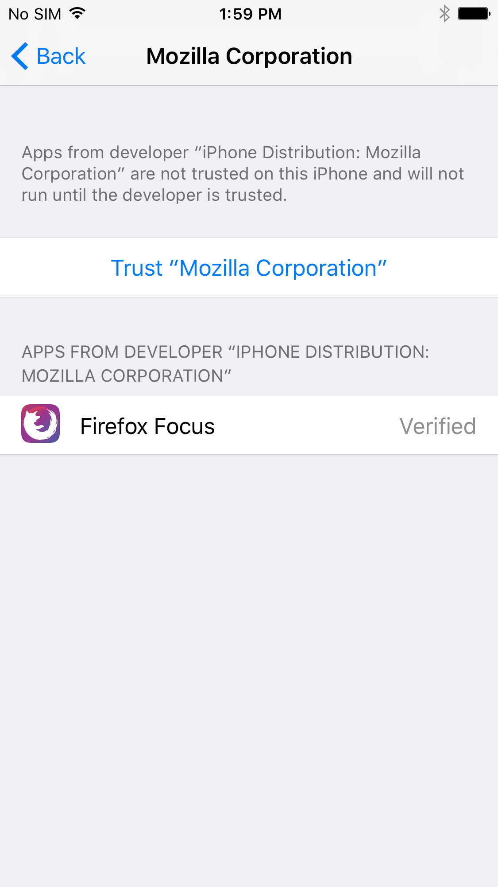
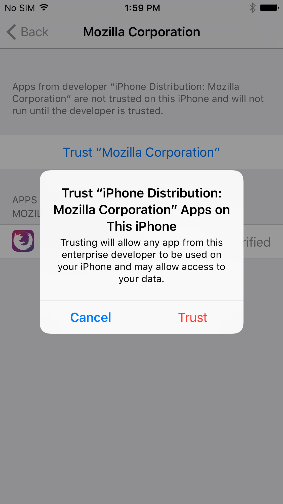

